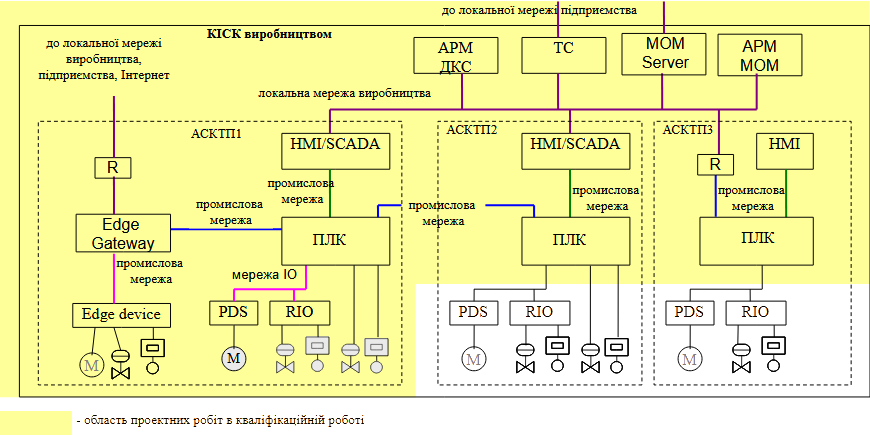

# 5. Структура кваліфікаційної роботи

## 5.1. Об'єкт та предмет дослідження та розробки в кваліфікаційній роботі

*Об’єктами дослідження (розробки)* в магістерській роботі за освітньо-професійною програмою "Комп’ютерні технології та програмування в автоматизованих системах управління" можуть бути автоматизовані системи керування виробництвом, технологічним комплексом та технологічними процесами чи обладнанням, які розробляться в даній роботі. 

Предмет — конкретне технічне рішення, принцип побудови, алгоритм, архітектура, програмний модуль, засоби інтеграції, методика налаштування тощо. Тобто те, на що спрямована інженерна робота. Об'єкти дослідження можуть співпадати у роботах здобувачів, тоді як предмети залежать від спеціального завдання. Нижче подано кілька прикладів.

## 5.2. Структура магістерської роботи

Структура кваліфікаційної роботи узгоджується з керівником і залежить від теми та вибраного спеціального завдання. У будь якому виападку вона містить вступну і основну частина та додатки.

**Вступна частина** містить такі структурні елементи:

- титульний аркуш;
- завдання з календарним планом виконання роботи;
- анотація (державною та англійською мовами);
- зміст;
- перелік умовних позначень, символів, скорочень і термінів (за необхідністю);
- вступ

Анотація призначена для ознайомлення з магістерською роботою. Вона має бути стислою (обсяг до однієї сторінки), але інформативною і повинна коротко розкривати призначення і зміст виконаної роботи. В кінці анотації повинні бути виділені ключові слова (від 5 до 15), які є найістотнішими для розкриття спрямованості магістерської роботи. 

У вступі, що починається з нової сторінки, необхідно розкрити сутність і стан задачі, що розв’язує магістрант, та її значущість, підстави для розробки обраної теми, обґрунтування необхідності виконання роботи. У першу чергу дається загальна характеристика необхідності автоматизації виробництва а також процесу, ділянки чи машини. Далі послідовно вказують актуальність роботи, мету та завдання роботи, об'єкт та предмети роботи, використовувані методи, елементи новизни та практичне значення з визначенням можливих науково-технічних, економічних та соціальних ефектів, а також коротка характеристика основних розділів магістерської роботи.

**Основна частина** роботи складається з розділів, підрозділів, пунктів та під-пунктів. Кожен розділ розпочинають з нової сторінки, а основному  тексту може передувати передмова із стислим описом змісту матеріалу. В кінці розділу можуть бути короткі висновки. 

Для основної частини роботи рекомендується наступна структура:  

- **Розділ 1.** Аналітичний огляд літератури та використовувані методи при побудові систем керування.
- **Розділ 2.** Загальносистемні рішення по створенню системи.
- **Розділ 3.** Математичне забезпечення підсистеми, що розробляється або спеціального завдання.
- **Розділ 4.** Апаратне та програмне забезпечення підсистеми або завдання, що розробляється.  
- **Висновки та рекомендації.** 
- **Список літератури.**

Назви розділів 3 та 4 рекомендується адаптувати до теми роботи. Рекомендації щодо змісту основних розділів наведені в п.6 даних методичних рекомендацій. 

Висновки та рекомендації розміщують на окремому аркуші. Вони є завершальною і важливою частиною магістерської роботи, що має продемонструвати отримані результати, ступінь реалізації поставленої мети та завдань. У висновках наводиться перелік усіх отриманих результатів та їх співвідношення із загальною метою і завданням роботи. Викладають найбільш важливі та практичні результати, одержані в роботі, які мають містити формулювання розв'язаної задачі. 

З нового аркуша наводиться список використаних літературних джерел, як правило, 40-60 найменувань, у тому числі публікації магістранта. Бібліографічні описи наводять у порядку їх згадування в тексті та відповідно до існуючих стандартів з бібліотечної та видавничої справ.

За необхідності, до **додатків** можуть бути включені: додаткові ілюстрації або таблиці; матеріали, які через великий обсяг або форму подання не можна включити до основної частини (фотографії, проміжні математичні докази, розрахунки; протоколи випробувань; інструкції, методики, лістинги програм та ін.).

## 5.3.  Зміст загальних розділів 

Розділ 1 містить аналітичний огляд літератури щодо об'єкту керування, а саме технологічного комплексу всього виробництва (рівень L3 відповідно до ДСТУ EN 62264-1) та окремого технологічного процесу, машини або відділення (L0-L2), якого стосується тема або спеціальне завдання. Крім стану автоматизації по відношенню до об'єкту, аналіз передбачає визначення статусу кво в предметі дослідження відповідно до вибраної теми та спеціального завдання. Розділ завершується висновками та переліком завдань які поставлені для кваліфікаційної роботи. 

Розділ 2 присвячений загальносистемним рішенням.  На рис.1 показаний приклад структури комп'ютерно-інтегрованої системи керування (**КІСК**) виробництвом. Частина проектних робіт в кваліфікаційній роботі стосуються КІСК в цілому, та передбачає інтеграцію існуючих автоматизованих систем керування технологічними процесами (АСКТП) суміжних відділень в єдину систему, а також підключенням додаткових контрольованих засобів через засоби промислового інтернету речей (IIoT). Таким чином в область робіт усіх магістерських робіт, незалежно від теми та спеціального завдання входять: 

- аналіз всього виробництва як об'єкту, існуючих систем АСКТП та формування технічних вимог до проектованої системи; 
- проектування мереж та програмного забезпечення КІСК виробництвом або виробничим цехом, шляхом інтеграції АСКТП, підсистем диспетчерського керування, MES/MOM, серверів архівування, тощо;   

рис.1. Область проектних робіт в курсовому проекті.

Результат цих робіт (артефакти) наводиться і наводяться в розділі 2. Також, якщо тема або спеціальне завдання передбачає певні додаткові роботи по загальносистемним рішенням (добавлення мережних вузлів, або ПЗ), вони також відображаються у цьому розділі.

## 5.4. Зміст розділів відповідно до вибраної теми

Інші роботи та їх артефакти залежать від вибраного завдання та узгоджується з керівником, саме вони висвітлюються в розділах 3 та 4, якщо ці роботи не стосуються загальносистемних рішень по всьому виробництву чи інфраструктури. Нижче наводяться рекомендації щодо наповнення розділів 3 та 4 в залежності від шаблону обраної теми. 

### Теми зі спеціальними завданнями, орієнтованими на керування виробничими операціями 

Дана тема передбачає виконання завдання по створенню підсистеми керування однією з категорій виробничих операцій в системі MOM. 

У третьому розділі рекомендується навести: 

- функціональну структуру виробництва з точки зору категорії виробничих операцій

- усі необхідні моделі та їх виведення відповідно до ISA-95/IEC-62264, зокрема:

  - ієрархічної моделі обладнання (Equipmnet та за необхідності Asset)

  - матеріалів

  - персоналу (за необхідності)

  - сегментів процесу

  - сегментів продукту

  - інші моделі (залежіть від обраної категорії та виробництва)

- автомати станів обладнання робочих центрів, яке передбачає інтегрування
- означення та спосіб розрахунку вибраних KPI (ключових показників ефективності)
- спеціалізовані алгоритми, відповідно до означених в спеціальному завданні, наприклад (це не обмежений перелік можливих):
  - визначення стану обладнання
  - розрахунку KPI
  - визначення місця розташування матеріалу   

Моделі передбачають опис властивостей та схематичне зображення зв'язків компонентів (наприклад для ієрархічної моделі обладнання). 

У четвертому розділі рекомендується навести:

- інформаційну структуру інтегрованої системи керування
- структуру та опис програмного забезпечення та його компонентів, яке використовується для побудови MOM
- фрагменти програм PLC, SCADA або IIoT, які реалізовують наведені алгоритми    

Приклад змісту можна знайти за посиланням https://github.com/pupenasan/MOMdisc/blob/main/%D0%BA%D1%83%D1%80%D1%81%D0%BE%D0%B2%D0%B8%D0%B9/method.md

### Теми зі спеціальними завданнями, орієнтованими на диспетчерських контроль та керування. 

Дана тема передбачає виконання завдання по створенню диспетчерського контролю та керування інфраструктурним об'єктом. Рішення може базуватися на класичних програмно-апаратних комплексах або з використанням засобів IIoT. 

У третьому розділі рекомендується навести: 

- ієрархічну модель обладнання та пристроїв яке контролюється/керується
- автомати станів обладнання та пристроїв та способи визначення чи алгоритми їх розрахунку
- концепція роботи аналітичних сервісів

- спеціалізовані алгоритми, відповідно до означених в спеціальному завданні, наприклад (це не обмежений перелік можливих):
  - розрахунок балансів 
  - визначення нештатних ситуацій та дій при них
  - визначення аналітичних показників або/та розрахунку KPI 

У четвертий розділ рекомендується включати 

- схему з’єднань та підключень проводок промислових мереж
- інформаційну структуру системи диспетчерського контролю та керування
- структуру та опис програмного забезпечення та його компонентів, яке використовується для побудови системи або підсистеми
- фрагменти програм PLC, SCADA або IIoT, які реалізовують наведені алгоритми    

### Теми зі спеціальними завданнями, орієнтованими на виконання спеціалізованої функції в складі системи керування. 

Дана тема передбачає виконання завдання по створенню конкретної підсистеми керування в складі ІСКВ, а також реалізацією певної функції, яка визначається спеціальним завданням.

У третьому розділі рекомендується навести: 

- опис та результати дослідження об'єкту (за необхідності)
- схему автоматизації підсистеми керування (за необхідності) 
- ієрархічну модель обладнання для ІСКВ в цілому для рівнів Enterpise, Site, Area, Workcentr (відповідно до ДСТУ EN 62264-1)
- ієрархічну модель обладнання для обраної підсистеми (відповідно до ДСТУ EN 61512 або ISA-106)
- означення класів обладнання для обраної підсистеми (в межах робочого центру) 
  - автомати станів обладнання для обраної підсистеми (робочого центру) 
  - означення інтерфейсу класів 
  - означення функціональних елементів
  - означення тривог
  - означення процедур
  - означення майстерданих 
- спеціалізовані алгоритми, відповідно до означених в спеціальному завданні

У четвертий розділ рекомендується включати 

- схему з’єднань та підключень проводок промислових мереж
- принципові електричні схеми (за необхідності)
- інформаційну структуру системи диспетчерського контролю та керування
- структуру та опис програмного забезпечення та його компонентів, яке використовується для побудови системи або підсистеми
- фрагменти програм PLC, SCADA або IIoT, які реалізовують наведені алгоритми    

### Теми зі спеціальними завданнями, орієнтованими на використання робототехнічних комплексів. 

Розробка автоматизованої системи керування виробництвом ...(вказується виробництво) ... з підсистемою керування ... (вказується ділянка) з використанням ... (вказується тип роботів).

Приклади тем: 

- Розробка автоматизованої системи керування виробництвом соусів з підсистемою керування пакуванням з використанням колаборативних роботів.

- Розробка автоматизованої системи керування виробництвом соусів з підсистемою керування пакування в палети промисловими роботами. 

  

- 

### Теми зі спеціальними завданнями, орієнтованими на використання цифрових двійників. 

Приклади тем:

- Розробка підсистеми контролю та обліку електроспоживання на цукровому виробництві з використанням цифрових двійників.
- Розробка підсистеми контролю та прогнозування стану двигунів на цукровому виробництві з використанням цифрових двійників.
- 

### Теми зі спеціальними завданнями, орієнтованими на побудову інтелектуальних систем. 

Шаблони:

- Розробка оперативної діагностики стану … (вказується конкретний технічний засіб, технологічний апарат чи комунікація) в системі керування (вказується виробництво);
- Розробка прикладної онтології … (вказується конкретна інтелектуальна підзадача) в системі керування (вказується виробництво);
- Розробка системи керування за прецедентами процесом…(вказується конкретний процес) в системі керування (вказується виробництво);
- Розробка експертної підсистеми …(вказується призначення системи) в системі керування (вказується виробництво);;
- Прогнозування стану/ситуації …(вказується технологічний процес або технічний засіб) в системі керування (вказується виробництво);
- Розробка підсистеми підтримки прийняття рішень …(вказується призначення системи) в системі керування (вказується виробництво);
- Розробка системи керування з прогнозуванням на основі нечіткої логіки процесом…(вказується конкретний процес) на (вказується виробництво);
- Розробка системи керування з прогнозуванням на основі нейромереж процесом…(вказується конкретний процес) на (вказується виробництво);
- Розробка підсистеми розпізнавання стану/ситуації/…(вказується призначення системи) в системі керування (вказується виробництво);

Приклади тем

Спеціальні теми