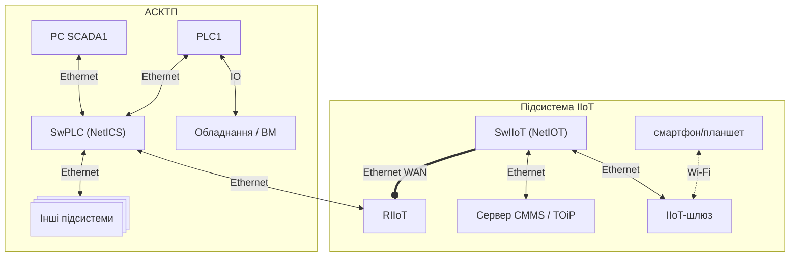
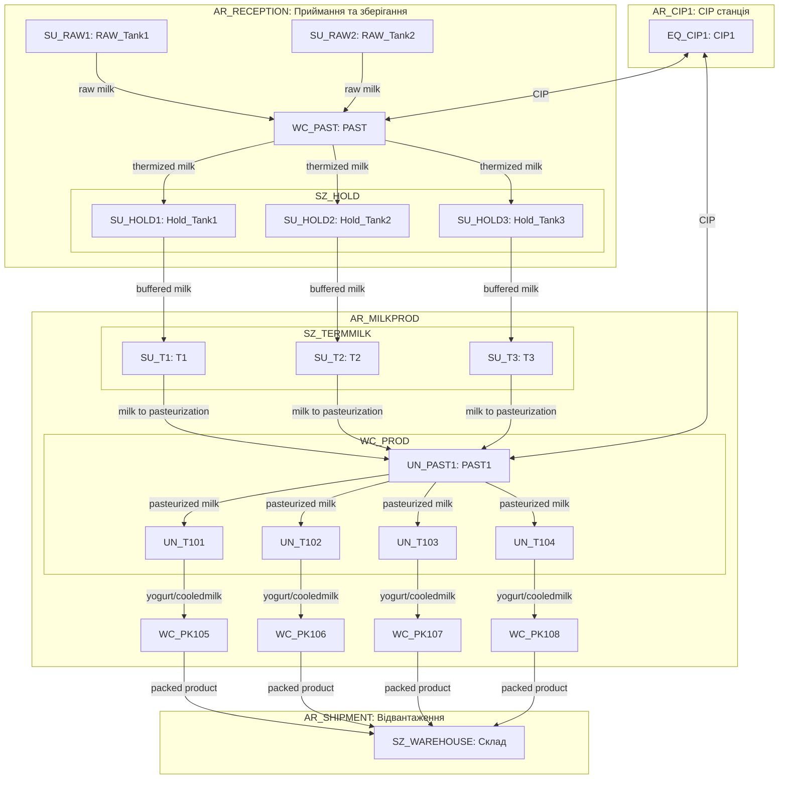
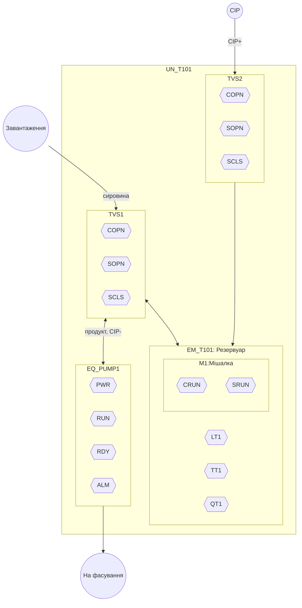
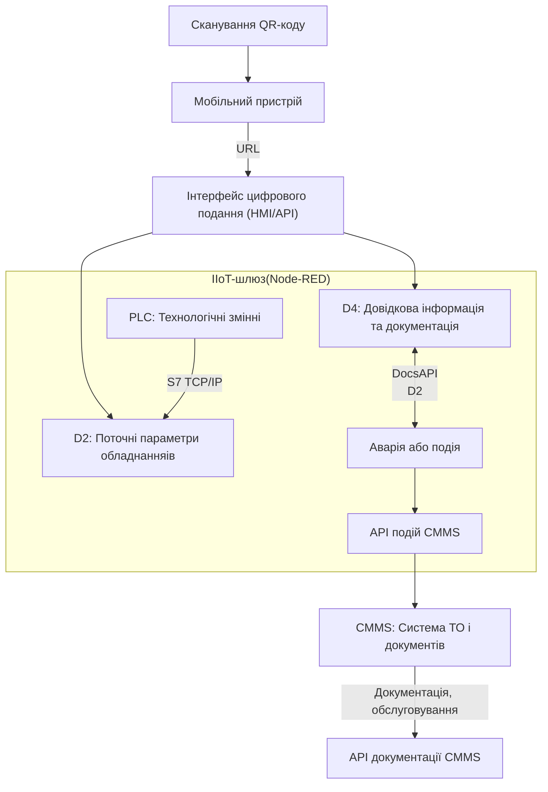
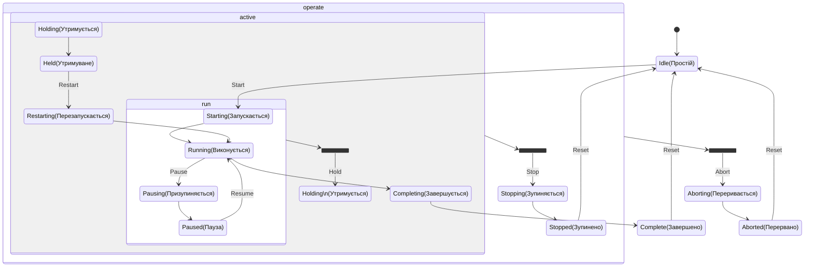
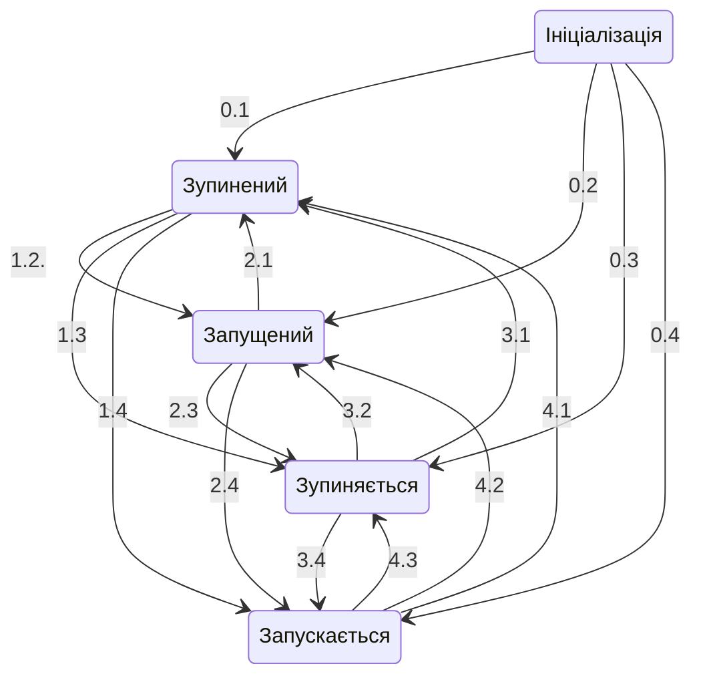
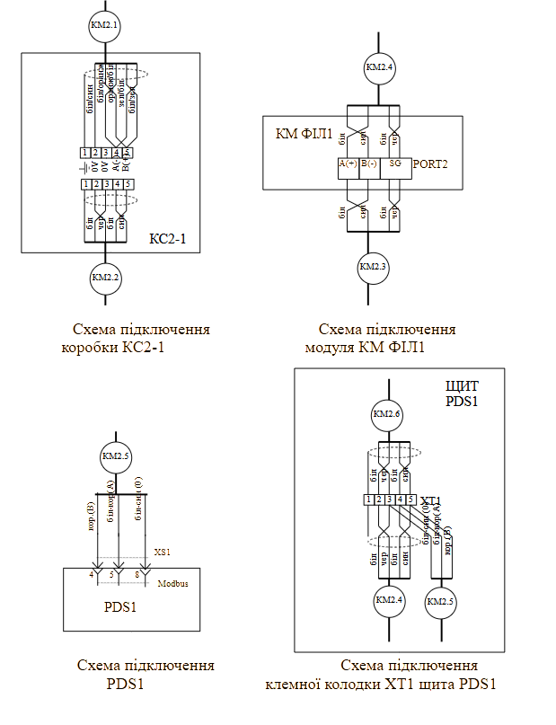
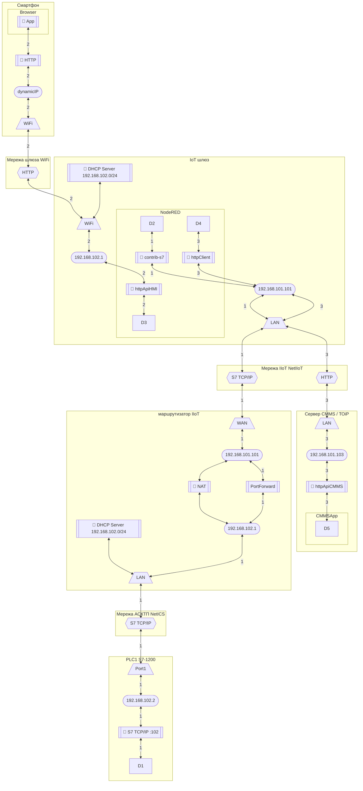

# 6. Вимоги до змісту кваліфікаційної роботи

## 6.1. Розділ 1 – Аналітичний огляд літератури та використовувані методи при побудові систем керування

У першому розділі роботи обов’язково повинен бути аналітичний огляд літератури за об’єктом автоматизації та існуючих науково-технічних розробок.  Задача літературного огляду – охарактеризувати етапи розвитку АСК цим об’єктом, оцінити розробки попередників, визначити питання для подальшого удосконалення цих систем. При аналізі літератури за об’єктом автоматизації треба звернути увагу на наступні аспекти:

- аналіз структур існуючих автоматизованих систем керування як в Україні, так і в інших країнах;
- аналіз існуючих алгоритмів координаційного керування між обладнанням, підсистемами одного та різного рівня;
- питанням горизонтальної (між підсистемами одного рівня) та вертикальної (підсистемами різного рівня) інтеграції;
- прийнятих принців декомпозиції
- аналіз стану до вибраного спеціального завдання

Таким чином, створюється основа для розробки нової або модернізація існуючої автоматизованої системи керування. 

Аналітичний огляд літератури та науково-технічних розробок повинен також показати, що здобувач ґрунтовно ознайомився з обраним об’єктом автоматизації, вміє систематизувати різні джерела, критично їх оцінювати, виділяти основні питання. Тут важливо визначити певну систематизацію матеріалу, проявити при аналізі системний підхід. У той же час магістерська робота розглядає конкретну тему, а не проблему в цілому, що повинно знайти відображення в аналітичному огляді літератури. Не допускається наводити ті джерела, з якими ознайомився магістрант, але вони не мають прямого відношення до теми. Також не варто наводити загальні теоретичні відомості, які читаються в дисциплінах.  

Розділ завершується висновками та переліком завдань які поставлені для кваліфікаційної роботи. 

## 6.2. Розділ 2 - Загальносистемні рішення по створенню системи

Розділ 2 присвячено розробленню загальносистемних рішень рівня керування виробничими операціями. Він охоплює моделювання структури КІСК виробництвом у цілому: як з функціонального, так і з технічного погляду. Метою є формування логічної, технічної та інформаційної основи для реалізації функцій обробки та керування виробничими процесами.

У межах цього розділу здобувач має виконати:

- побудову функціональної структури КІСК, яка відображає розподіл функцій, задач і операцій між різними рівнями системи;
- розроблення структурної схеми комплексу технічних засобів (КТЗ), що показує апаратну реалізацію функціональної структури;

У цьому розділі не потрібно деталізувати функціонування підсистеми IIoT, якщо така має місце, однак необхідно відобразити технічні засоби, через які забезпечується її інтеграція з іншими частинами КІСК. Це особливо важливо в структурній схемі КТС, де мають бути вказані шлюзи, комутатори або інші мережні компоненти, які забезпечують взаємодію між рівнями SCADA, PLC та IIoT.

Усі матеріали цього розділу повинні бути логічно пов’язані між собою: функціональна структура має означувати необхідні функції, які реалізуються апаратно в структурній схемі, пов’язані між собою мережними з’єднаннями, та взаємодіють відповідно до описаної інформаційної структури.

Рекомендується виконувати схеми у єдиному стилі, дотримуючись ієрархічної організації (наприклад, L0–L3) та погодженої нотації, узгодженої з керівником проєкту. Усі позначення, абревіатури та скорочення мають бути пояснені окремою таблицею або виноскою.

### Функціональна структура

Функціональна структура розробляється для КІСК виробництвом, якщо інше не оговорене в завданні до кваліфікаційної роботи. Вона створюється на основі вихідних даних, які є викладеними характеристиками об’єкту (все виробництво та ділянка основного відділення) та вимог до нього.  

Характеристика функціональної структури може включати схему функціональної структури та опис автоматизованих функцій. Функції, що повинні виконуватися системою, розбивають на декілька взаємопов’язаних інформаційними зв’язками під-функцій, згідно їх реалізації на окремих технічних засобах. Ці функції та інформаційні зв’язки показуються на функціональній структурі. Схема функціональної структури виконується в довільній формі. Вона може включати:

- елементи функціональної структури КІСК (підсистем АС); автоматизовані функції та (або) задачі (комплекси задач); сукупність дій (операцій), які виконуються при реалізації автоматизованих функцій тільки технічними засобами (автоматично) або тільки людиною;
- інформаційні зв’язки між елементами та з зовнішнім середовищем та короткою вказівкою змісту повідомлень та (або) сигналів, які передаються по зв’язкам, та при необхідності, зв’язки інших типів;
- деталізовані схеми частин функціональної структури (при необхідності).

Схему загальної функціональної структури КІСК виробництвом або інфраструктурним об'єктом рекомендується показувати зі збереженням функціональної ієрархічності рівнів керування (див. рис.1). Наприклад: 0-й (нижній) рівень – рівень польових засобів, 1-й – рівень контролерів, 2-й рівень – рівень SCADA/HMI, 3-й рівень – рівень керування виробництвом. До схеми функціональної структури додається таблиця умовних позначень, приклад якої показано в таблиці 1.

  

 Рис.2. Фрагмент функціональної структури інтегрованої КІСК виробництвом цукру.

Таблиця 1. Таблиця умовних позначень до схеми функціональної структури.      

| Позначення                    | Найменування                                                 |
| ----------------------------- | ------------------------------------------------------------ |
| польові ТЗА                   | технічні засоби автоматизації, які відносяться до польового рівня |
| dif                           | відділення дифузії                                           |
| sat                           | дефекосатурації, не включаючи фільтри                        |
| f1, f2, f3                    | 1-й..4-йфільтри після 1-ї сатурації                          |
| ПЛК ДИФ                       | мікропроцесорний контролер для дифузійного відділення        |
| ПЛК САТ                       | мікропроцесорний контролер для 1-ї та 2-ї дефекосатурації    |
| ПЛК ФІЛ1                      | мікропроцесорний контролер для 1-го фільтру 1-ї сатурації    |
| ПК ДИФ                        | АРМ оператора дифузії (на базі комп’ютера)                   |
| ПК САТ                        | АРМ оператора дефекосатурації (на базі комп’ютера)           |
| ОП ФІЛ1                       | операторська панель для 1-го фільтру (входить до складу АРМ оператора фільтр. соку 1 сат) |
| ПК ДКС                        | диспетчерсько-координуюча станція – АРМ начальника зміни на базі комп’ютера |
| ТС ВЦ                         | технологічний сервер виробництва цукру - сервер архівів основних виробничих параметрів |
| dif.Е0, sat.E0, f1.E0         | вимірювальне перетворення                                    |
| dif.V0, sat.V0, f1.V0         | керування технологічним обладнанням та виконавчими механізмами |
| dif.Y0,sat.Y0, f1.Y0          | перетворення та обробка інформації на польовому рівні, включаючи цифрові інтерфейсі зв’язки |
| dif.Y1, sat.Y1, f1.Y1         | збір та обробка даних на рівні контролерів, включаючи цифрові інтерфейсні зв’язки |
| dif.C1, sat.C1, f1.C1         | автоматизоване регулювання та керування технологічним процесом, включаючи дискретне керування |
| dif.Y2, sat.Y2, f1.Y2, dks.Y3 | збір та обробка даних на рівні SCADA/HMI (база даних реально часу) |
| dif.HС2, sat.HС2, f1.HС2      | дистанційне керування, формування завдання, настройка регуляторів, включення, відключення, переключення, блокування, запуск задач, зміна режимів роботи регуляторів |
| dif.I2, sat.I2, f1.I2         | відображення для контролю за технологічним процесом          |
| dks.I3                        | відображення для диспетчерського контролю за виробничим процесом |
| dks.Itr3                      | відображення архівних даних по всьому виробництву            |
| dif.Rtr2, sat.Rtr2            | ведення трендового архіву технологічного процесу             |
| dks.Rtr3                      | ведення трендового архіву виробництва                        |
| dif.Rlg2, sat.Rlg2            | ведення журналу повідомлень                                  |
| dif.A2, sat.A2, f1.A2         | контроль стану обладнання, сигналізація (тривоги та події)   |
| dif.Alg2, sat.Alg2, f1.Alg2   | ведення журналу подій та тривог                              |

Інформаційні зв’язки (інформаційні потоки) між функціями та задачами можна показувати у вигляді стрілок, які вказують на напрямок передачі інформації, або без стрілок, якщо інформація передається в обидва боки. Інформаційні зв’язки, які передбачено реалізовувати в курсовому проєкті можна маркувати цифрами, для подальшого посилання на них в текстовій частині.

Щоб не загромаджувати схему великою кількістю функцій, їх можна об’єднувати по загальному функціональному призначенню, даючи їм позначення, наприклад, за правилами функціонального позначення на схемах автоматизації. Так, в прикладі на схемі (рис.2), для рівня польових ТЗА, можна виділити загалом три типи функцій: вимірювання або первинне перетворення (`E`); реалізація управляючих дій з використанням виконавчих механізмів (`V`); інші типи перетворення (`Y`). Усі інші функції можна буде вказати та деталізувати на схемах автоматизації, якщо такі передбачаються в проєкті. Всі функції рівня контролерів в прикладі виділені в дві групи: автоматичного керування (`C`), включаючи функції дискретного керування; збір та обробка даних на рівні контролерів (`Y`), включаючи цифрові інтерфейсні зв’язки. Усі інші групи функцій (наприклад сигналізація, архівування, тощо) в даному випадку не використовуються. Для рівня SCADA/HMI та диспетчерського керування, всі функції виділені в такі групи: збір та обробка даних реально часу (`Y`), дистанційне керування та зміна режимів роботи з ЛМІ (`HC`), відображення на засобах ЛМІ (`I`), ведення трендового архіву (`Rtr`), ведення журналу повідомлень (`Rlg`), ведення журналу подій та тривог (`Alg`), сигналізація (`А`).

Кожна з підсистем в прикладі має своє умовне позначення (`dif`, `sat`, `f1`). Враховуючи, що кожна підсистема функціонально складається з 3-х рівнів, групу функцій зручно позначати з комбінації: підсистема + функціональна група + функціональний рівень.    

Набір функцій кожного рівня для конкретної системи може відрізнятись. Так, наприклад, при використанні вбудованих регуляторів в перетворювачах частоти або RIO, на польовому рівні бажано показати ці групи функцій літерою `C`, в використання вторинних показуючи приладів - літерою `I`, пристроями байпасного керування - `HC`, і т.п. 

Функціональну структуру можна виконувати у будь-якому графічному редакторі, у тому числі в представленні Mermaid. У будь якому випадку, зовнішній вигляд та позначення елементів функціональної структури уточнюється здобувачем з керівником роботи.

У текстовій частині в описі автоматизованих функцій (П3) пояснюється та уточнюється схема функціональної структури. Зокрема необхідно вказати:

- перелік функцій/задач та  вимоги до періодичності та тривалості їх виконання;
- перелік сигналів та даних, які формують інформаційні зв’язки між функціями/задачами;
- вимоги до періодичності відновлення сигналів та даних на входах функцій/задач.  

У даному розділі наводиться загальна концепція, тоді як деталізація за необхідності вказується в розділі 3.

### Структура КТЗ

Розроблення структурної схеми комплексу технічних засобів, підбір технічних засобів верхніх рівнів керування та комунікаційних модулів ПЛК та RIO проводиться на основі вихідних даних, які наведені в завданні та функціональної структури. На структурній схемі КТЗ вказуються тільки ті ТЗА, які інтегруються в єдину систему з використанням промислових мереж. 

Розробка структури КТЗ передбачає:

-     вибір промислових та комп’ютерних мереж, на базі яких проводиться технічна інтеграція засобів;

-     створення мережної структури, в якій технічні засоби є вузлами мережі;

-     вибір мережного обладнання (комунікаційні модулі, карти) для всіх мережних вузлів;

-     вибір мережних складових з функціями перетворення: репітерів, концентраторів, комутаторів, маршрутизаторів та шлюзів.

-     вибір технічних засобів IIoT та їх інтегрування в КІСК   

Процес створення структури КТЗ може мати ітераційний характер. Спочатку проводиться аналіз функціональних вимог в завданні, оцінюється характер і напрямки інформаційних потоків між вузлами, оцінюється інформаційне навантаження. Враховуючи вимоги які дані в завданні, вибирається мережна структура та мережне обладнання. Мережна структура аналізується на придатність. Якщо вона не задовольняє по певним причинам вимогам (не вистачає ресурсів мережі або мережних засобів) - процес повторюється. 

Мережна структура відображається графічно на структурній схемі КТЗ. Рекомендується виконувати схему в Mermaid або іншому редакторі, що зберігається в текстовому форматі. До схеми у вигляді окремого документу додається перелік елементів ТЗА (мережних вузлів).   

Структурну схему КТС КІСК рекомендується зображати зі збереженням функціональної ієрархічності рівнів керування відповідно до схеми функціональної структури. Схема повинна містити інформацію про засоби (комунікаційні карти, модулі) та порти, через які кожен вузол підключається до загальної мережі а також додаткові перетворювачі. Приклад структурної схеми показаний на рис.3, приклад переліку елементів ТЗА наведений в таб. 2. 

Рис.3. Приклад структурної схеми КТЗ 

Таблиця 2. Відомість мережних технічних засобів.

| Позначення                 | Найменування                                                 | К-сть | Примітка                                                     |
| -------------------------- | ------------------------------------------------------------ | ----- | ------------------------------------------------------------ |
| ПК ДКС                     | ПК начальника  зміни                                         | 1     | офісного виконання                                           |
| ПК САТ                     | ПК  оператора дефекосатурації                                | 1     | офісного виконання                                           |
| ПК ДИФ                     | ПК оператора  дифузії                                        | 1     | вже експлуатується                                           |
| ПЛК  САТ                   | Програмований  логічний контролер відділення очистки         | 1     | TSX Premium (з Unity) з комм.  картою Modbus RS-485 TSX SCP 114 |
| ПЛК  ФІЛ1-3                | Програмований  логічний контролер фільтрації відділення очистки | 3     | вже експлуатується  TWD LCAA 40DRF з ком. модулем   TWD NOZ 485 T |
| ОП  ФІЛ1, ОП ФІЛ2, ОП ФІЛ3 | Операторська  панель фільтрації відділення очистки           | 3     | вже експлуатується  XBTN400                                  |
| PDS1                       | Частотний  перетворювач відкачка соку з хол. дефекатора      | 1     | ATV71 з інтегрованим Modbus RTU                              |
| RIO1                       | Віддалені  входи/виходи                                      | 1     | Advantys OTB на базі OTB  1S0DM9LP (Modbus RTU)              |
| КАМ                        | Комунікаційний  адаптер перетворювач RS-232<->RS-485         | 1     | TSX PCX 1031 (Schneider  Electric)                           |

На рис.4 показаний приклад виконання схеми в Mermaid для системи що має  в складі підсистему промислового Інтернету речей (IIoT) 

рис.4. Приклад фрагменту структурної схеми КТЗ з підсистемою IIoT

Детально про виконання структурних схем показано в [1]-[3]. 

## 6.3. Розділ 3 - Математичне забезпечення підсистеми, що розробляється або спеціального завдання.

Зміст цього розділу визначається темою та спеціальним завданням, тому нижче будуть наведені рекомендації, щодо виконання схем та пунктів.

### Формування моделі обладнання

У межах роботи формування моделі обладнання стосується побудови структурованого уявлення про об’єкти керування, їхню ієрархію, атрибути, взаємозв’язки та інтерфейси, що використовуються у підсистемах рівня L3 (керування виробничими операціями) та L2–L1 (АСКТП). До складу робіт входить:

1. Декомпозиція обладнання відповідно до виробничої структури.
2. Класифікація обладнання за типами (запірні пневматичні клапани, регулюючі заслінки, датчики, агрегати, резервуари, лінії, тощо).
3. Означення інтерфейсу класу обладнання.
4. Означення функціональних елементів обладнання.

Нижче показаний приклад декомпозиції обладнання, виконання інших пунктів показано в [1]. 

Варто звернути увагу, що процес декомпозиції, так само як і виконання інших розділів має ітераційний характер. Це значить, що в розділах наводяться результати діяльності, а зміст цих результатів з часом змінюється, на черговій ітерації виконання, за результатами наступних пунктів роботи. 

У результаті декомпозиції означується:

- перелік виділеного обладнання з символьним позначенням та зазначеними рівнем ієрархії 
- означення зв'язків з іншим обладнанням: ієрархічних в рольовій ієрархії, горизонтальних по потоку, блокувальних і т.п.
- визначення можливих входів/виходів з процесом: перелік датчиків, виконавчих механізмів, іншого обладнання, з яким є зв'язки або потенційно можуть з'явитися.   

Для декомпозиції обладнання треба добре розуміти виробництво та ділянку технологічного процесу, для якого проводиться декомпозиція. У якості вихідних даних добре підходять апаратурно-технологічні схеми та схеми автоматизації. Рекомендації щодо проведення декомпозиції наведені в конспекті лекцій [1], тут зробимо кілька рекомендацій щодо виконання в кваліфікаційній роботі.   

Враховуючи що ієрархію обладнання необхідно розробити як для виробництва так і для основного технологічного процесу, рекомендується ієрархію показати двома або трьома окремими схемами/таблицями:

- верхні рівні обладнання (ERP<->MOM): `Enterprise -> Site -> Area`
- середні рівні обладнання (MES/MOM<->АСКТП): `Area -> Work Centers -> Units` 
- нижні рівні обладнання (АСКТП): `Unit -> Equipment Modules` 

Це дає змогу зробити необхідну деталізацію для кожного з рівнів.      

При графічному поданні для відображення всіх типів зв'язків між обладнанням, ієрархію рекомендується подавати через відображення вкладеності, тоді як інші зв'язки через лінії або стрілки. Наприклад в Mermaid для цього добре підходять схеми `flowchart`, де вкладеність можна показати через `subgraph`, що відображають структурну підлеглість (`area` → `work center` → `unit` → `equipment module`), а стрілками між об’єктами можна вказати на продуктові потоки (наприклад, молоко, йогурт) або енергетичні/допоміжні потоки (наприклад, CIP, холодоагент). 

У залежності від теми кваліфікаційної роботи можна вказувати схему для підприємства та основного виробництва. На рис.5 наведено приклад фрагменту рольової структури підприємства з виробництва молочних продуктів у форматі `Mermaid` до рівня `Unit` включно, де показано як обладнання (Equipment) структуровано за цехами та модулями, а також відображено основні технологічні потоки між ними. У цій моделі: вся структура обладнання розподілена за функціональними ділянками (area), кожен об’єкт має рольовий префікс (`SU_`, `EQ_`, `WC_`, `SZ_` тощо). Стрілки позначають напрямки переміщення продукту між обладнанням, що дозволяє поєднати фізичну структуру і логіку виробничого процесу в єдиній візуальній формі. Така схема корисна в розрізі проектування на рівні MOM. 

рис.5. Приклад відображення ієрархії обладнання (Equipment) в контексті виробничих потоків від рівня Site до рівня UNIT.

Для рівня АСКТП варто розглядати декомпозицію починаючи від робочого центру, який як правило є основним технологічним процесом, вказаним в завданні на курсовий проєкт. Якщо робочий центр має кілька технологічних одиниць (Unit), то варто робити схеми на кожну з них. На рис. 6 показаний приклад такої схеми для танка приготування продукту (`UN_T101`), в якому відображено типову внутрішню структуру обладнання до рівня `Control Module`.

рис.11. Приклад відображення ієрархії обладнання в контексті виробничих потоків від рівня UNIT до CM.

Під схемами варто наводити перелік умовних позначень, наприклад як це показано в таблиці 3. 

Таблиця 3. Перелік умовних графічних позначень

| Графічне позначення                                          | Найменування                           | Примітка                                                     |
| ------------------------------------------------------------ | -------------------------------------- | ------------------------------------------------------------ |
|  | Обладнання що включає інше обладнання  | включеність через влкадення, позначення в Mermaid `subgraph` |
|  | CM нижнього рівня                      | не має вкладених CM, позначення в Mermaid  `T101_PUMP_PWR{{PWR}}` |
|  | Вхідний / вихідний технологічний потік | Місця підключення до суміжного обладнання                    |
|  | Матеріальний або енергетичний потік    |                                                              |

У даному розділі також необхідно описати аргументацію прийнятих рішень, в якій зазначити:

- які критерії були основними при проведенні декмопозиції
- рекомендації яких стандартів було враховано при декомпозиції
- які зв'язки між обладнанням було враховано 

Таблиця 4. Перелік позначень

| **Позначення**   | **Тип елемента**             | **Опис / Функція**                                |
| ---------------- | ---------------------------- | ------------------------------------------------- |
| `UN_T101`        | Unit                         | Технологічна одиниця (танк приготування продукту) |
| `EM_T101`        | Equipment Module             | Основний резервуар                                |
| `T101_LT1`       | Control Module (Датчик)      | Вимірювання рівня                                 |
| `T101_TT1`       | Control Module (Датчик)      | Вимірювання температури                           |
| `T101_QT1`       | Control Module (Датчик)      | Вимірювання витрати                               |
| `T101_M1`        | Control Module (Мішалка)     | Виконавчий механізм змішування                    |
| `T101_M1_CRUN`   | Control Module (Керування)   | Команда на запуск мішалки                         |
| `T101_M1_SRUN`   | Control Module (Датчик)      | Зворотний сигнал роботи мішалки                   |
| `T101_TVS1`      | Control Module (Клапан)      | Клапан для завантаження / відкачування            |
| `T101_TVS1_COPN` | Control Module (Керування)   | Команда відкрити клапан TVS1                      |
| `T101_TVS1_SOPN` | Control Module (Датчик)      | Датчик — положення “відкрито” для TVS1            |
| `T101_TVS1_SCLS` | Control Module (Датчик)      | Датчик — положення “закрито” для TVS1             |
| `T101_TVS2`      | Control Module (Клапан)      | Клапан подачі CIP-розчину                         |
| `T101_TVS2_COPN` | Вихід сигналу                | Команда відкрити клапан TVS2                      |
| `T101_TVS2_SOPN` | Вхід сигналу                 | Датчик — положення “відкрито” для TVS2            |
| `T101_TVS2_SCLS` | Вхід сигналу                 | Датчик — положення “закрито” для TVS2             |
| `EQ_PUMP1`       | Equipment Module             | Насосний агрегат                                  |
| `T101_PUMP_PWR`  | Вхід сигналу                 | Наявність живлення насоса                         |
| `T101_PUMP_RUN`  | Вхід сигналу                 | Стан: насос обертається                           |
| `T101_PUMP_RDY`  | Вхід сигналу                 | Насос готовий до роботи                           |
| `T101_PUMP_ALM`  | Вхід сигналу                 | Стан аварії насоса                                |
| `IN_PRODUCT`     | Умова/вузол (вхідний потік)  | Завантаження сировини                             |
| `IN_CIP`         | Умова/вузол (вхідний потік)  | Подача CIP-розчину                                |
| `OUT_PRODUCT`    | Умова/вузол (вихідний потік) | Продукт на фасування                              |

### Приклад алгоритму виконання задачі

Алгоритм виконання задачі можна оформляти в довільному вигляді і з будь яким інструментом. Нижче показаний приклад алгоритму для одного з завдань системи IIoT.

Хід взаємодії показаний на рис.12:

1. Ідентифікація обладнання. Персонал сканує QR-код, який містить URL на цифрове подання обладнання. Вебінтерфейс шлюзу надає доступ до пов’язаної інформації (поточний стан, документи, обслуговування).
2. Оновлення поточних параметрів. IIoT-шлюз періодично зчитує дані з PLC1 (струм, тиск, аварійні сигнали тощо) та оновлює локальні структури (`D2`). Ці значення доступні для перегляду або обробки.
3. Взаємодія з CMMS. У разі події (наприклад, спрацювання аварії) шлюз формує повідомлення і надсилає його в CMMS через API. Також шлюз періодично запитує з CMMS довідкову інформацію та документацію про обладнання (останні обслуговування, планові операції тощо).
4. Кешування документації. Отримана з CMMS документація (інструкції, креслення, паспорти) зберігається локально на шлюзі в структурі `D4`, що забезпечує доступ до неї навіть без активного інтернет-з'єднання.
5. Локальне керування (опційно). Якщо передбачено сценарій керування (наприклад, запуск CIP, скидання аварії), інтерфейс забезпечує авторизованому користувачу доступ до відповідних функцій.

Особливості реалізації

- Взаємодія здійснюється виключно через локальну Wi-Fi мережу шлюзу;
- Всі змінні та документи прив’язані до ID обладнання, який одночасно:
  - є ключем у PLC-структурі;
  - використовується в URL;
  - відображається в CMMS;
- Передача даних в CMMS — подієва, але може бути й періодичною;
- Безпека: реалізовано авторизацію, обмеження доступу, кешування мінімуму необхідних даних

рис.12. Логічна діаграма процесу взаємодії в підсистемі IIoT у форматі 

- QR → Phone → HMI — користувач отримує доступ до цифрового подання.

- PLC → D2 — зчитуються поточні параметри з ПЛК.

- CMMS → D4 — передаються інструкції, паспорти, планові дії.

- D2 → CMMS — при подіях (аварія, перевищення), шлюз передає дані назад у CMMS.

### Моделі для керування виробничими операціями

Для тем кваліфікаційних робіт, які потребують розроблення елементів MOM необхідно навести моделі. Детально про це можна почитати в [4] [5].

#### Сегменти процесів

Наводяться переліки сегментів процесів та їх опис. У описі необхідно вказати назви сегментів процесів, їх опис та перелік параметрів. Приклад сегментів процесів наведений в таблиці 5.

Таблиця 5. Приклад сегментів процесів

| Назва               | Тип          | Опис                                                         | Параметри                                                    |
| ------------------- | ------------ | ------------------------------------------------------------ | ------------------------------------------------------------ |
| Thermization        | Process      | Термізація. Для первинної обробки молока для попереднього збереження, включає в себе: термічну обробку за заданими параметрами, нормалізацію (доведення до необхідної жирності), гомогенізацію | задана температура, задана жирність                          |
| Milk  Production    | BatchProcess | Приготування молока. Включає в себе: охолодження молока, зберігання під час фасування. Приготування йде відповідно до рецептури. |                                                              |
| Yogurt Production   | BatchProcess | Приготування йогурту. Включає в себе: охолодження, сквашування, перемішування, зберігання під час фасування. Приготування йде відповідно до рецептури. | температура охолодження, час сквашування                     |
| Filling_bottle      | Process      | Наповнення в пляшки.                                         |                                                              |
| Filling_can         | Process      | Наповнення в банки.                                          |                                                              |
| Filling_tetrapack   | Process      | Наповнення в упаковки "тетрапак".                            |                                                              |
| Pasterization Milk1 | Process      | Пастеризація молока. Для термічної обробки молока для заданого типу продукту. | задана температура,  час витримки, задана температура охолодження |
| Paletizing          | Process      | Завантаження палет.                                          |                                                              |

#### Обладнання MOM

Наводиться перелік обладнання рівня робочих і нижче центрів та їх опис. Оскільки загальна модель обладнання описується в ієрархії тут приводяться уже конкретні властивості обладнання, які потрібні для моделювання відповідних ресурсів в контексті завдання MOM. Обладнання варто описувати в окремих підпунктах, згрупованих за рівнем та за призначенням. Зокрема, можна виділити кілька підпунктів:

- виробничі робочі центри (Work Center): вказується розташування (цех), тип процесу, одиниці вимірювання, перелік сегментів процесів які реалізує, продуктивність, кількість операторів на зміну;  
- технологічні вузли (Work Unit) в межах кожного робочого центра, якщо планується їх виділяти в межах MOM: вказується розташування (робочий центр), можливі технологічні операції, продуктивність/ємність, клас (якщо існує);    
- зони зберігання (Storage zone) та вузли зберігання (Strogae Unit):розміщення, ємність, додаткові характеристи;
- нижні рівні обладнання (Equipment), якщо планується їх означення в MOM: вимірювальні параметри, спосіб інтеграції з вказівкою джерела даних, опис автоматів станів  

У таблиці 6 наведений приклад опису обладнання рівня робочих центрів, у таблиці 7 - зон та вузлів зберігання, таблиці 8  - нижніх рівнів по відношенню до MOM, таблиці 9 - перелік параметрів для інтегрування.

Таблиця 6. Робочі центри

| Цех                 | Робочий центр | Тип             | Од. вим. | Перелік процесів                    | Опис                                  | Продуктивність |
| ------------------- | ------------- | --------------- | -------- | ----------------------------------- | ------------------------------------- | -------------- |
| RECEPTION & STORAGE | WC_PAST       | Production Unit | літр     | Thermization                        | пастеризатор                          | 20000 л/год    |
| MilkProd            | WC_PAST1      | Production Unit | літр     | Pasterization Milk1                 | пастеризатор                          | 5000 л/год     |
| MilkProd            | WC_PK105      | Production Line | шт       | Filling_bottle                      | машина  фасування в пляшку            | 50 шт/хв       |
| MilkProd            | WC_PK106      | Production Line | шт       | Filling_tetrapack                   | машина  фасування в паперову упаковку | 70 шт/хв       |
| MilkProd            | WC_PK107      | Production Line | шт       | Filling_can                         | машина  фасування в банку             | 80 шт/хв       |
| MilkProd            | WC_PK108      | Production Line | шт       | Filling_bottle                      | машина  фасування в пляшку            | 50 шт/хв       |
| MilkProd            | WC_T101       | Process Cell    | літр     | MilkProduction    Yogurt Production | танк                                  | 1000 л/год     |
| MilkProd            | WC_T102       | Process Cell    | літр     | MilkProduction    Yogurt Production | танк                                  | 2000 л/год     |
| MilkProd            | WC_T103       | Process Cell    | літр     | MilkProduction    Yogurt Production | танк                                  | 2000 л/год     |
| MilkProd            | WC_T104       | Process Cell    | літр     | MilkProduction    Yogurt Production | танк                                  | 1500 л/год     |
| Shipment            | WC_PL109      | Production Line | шт       | Paletizing                          | складання в палети                    | 30 шт/год      |
| Shipment            | WC_PL110      | Production Line | шт       | Paletizing                          | складання в палети                    | 30 шт/год      |

Таблиця 7. Вузли та зони зберігання

| Цех                 | Зона             | Вузол            | Тип                          | Од. вим | Опис                       | Місткість | Правило |
| ------------------- | ---------------- | ---------------- | ---------------------------- | ------- | -------------------------- | --------- | ------- |
| RECEPTION & STORAGE | Raw Tanks        | RAW Tank1        | Tank Storage Unit            | літр    | танки сирого молока        | 20000     | Пропорц |
| RECEPTION & STORAGE | Raw Tanks        | RAW Tank2        | Tank Storage Unit            | літр    | танки сирого молока        | 20000     | Пропорц |
| RECEPTION & STORAGE | Holding Tanks    | Holding Tank1    | Tank Storage Unit            | літр    | танки термізованого молока | 20000     | FIFO    |
| RECEPTION & STORAGE | Holding Tanks    | Holding Tank2    | Tank Storage Unit            | літр    | танки термізованого молока | 20000     | FIFO    |
| MilkProd            | Conv             | Conv1            | Simple Conveyer Storage Unit | шт      | конвеєр продукції          | 3000      | FIFO    |
| MilkProd            | SZ_NOPAST1       | SU_T1            | Tank Storage Unit            | літр    | танки сумішей              | 10000     | FIFO    |
| MilkProd            | SZ_NOPAST1       | SU_T2            | Tank Storage Unit            | літр    | танки сумішей              | 9000      | FIFO    |
| MilkProd            | SZ_NOPAST1       | SU_T3            | Tank Storage Unit            | літр    | танки сумішей              | 10000     | FIFO    |
| Shipment            | SZ_FinishedGoods | SU_FinishedGoods | BufferStorageUnit            | шт      | буфер зберігання продукції |           |         |

Таблиця 8. Перелік нижнього рівня Equipment з точки зору інтеграції з MOM з АСКТП

| **Equipment** | Робочий центр | Опис                   | Вузол АСКТП |
| ------------- | ------------- | ---------------------- | ----------- |
| EQ_PAST1      | WC_PAST1      | Unit неперервного типу | PLC Past1   |
| EQ_T101       | WC_T101       | Batch Unit             | PLC Prod    |
| EQ_T102       | WC_T102       | Batch Unit             | PLC Prod    |
| EQ_T103       | WC_T103       | Batch Unit             | PLC Prod    |
| EQ_T104       | WC_T104       | Batch Unit             | PLC Prod    |
| EQ_PK105      | WC_PK105      | Machine                | PLC PK105   |
| EQ_PK106      | WC_PK106      | Machine                | PLC PK106   |
| EQ_PK107      | WC_PK107      | Machine                | PLC PK107   |
| EQ_PK108      | WC_PK108      | Machine                | PLC PK108   |

Таблиця 9. Перелік параметрів для EQ_PAST1

| Назва  | Тип    | Опис                             | Призначення                                       | Тригер               |
| ------ | ------ | -------------------------------- | ------------------------------------------------- | -------------------- |
| STA    | uint32 | стан пастеризатора               | синхронізація з станом операції                   | -                    |
| ALM    | uint32 | набір бітів загальних тривог     | запис в базу, відображення                        | -                    |
| CMD    | uint32 | команда керування пастеризатором | керування запуском/зупинкою                       | старт/зупин операції |
| STEP   | uint32 | крок програми                    | запис в базу, відображення                        | -                    |
| RECIPE | uint32 | номер виконуваного рецепту       | керування, запис в базу, відображення             | старт операції       |
| FIQ1   | double | кількість на виході              | запис в базу, відображення, KPI                   | -                    |
| TT1    | double | температура на виході            | запис в базу, відображення, KPI, керування якістю | -                    |

#### Сегменти продукту

Наводиться перелік сегментів продукту з їх описом. Також варто навести структуру очікуваних продуктів у вигляді схеми, наприклад так, як показано на рис.13. При цьому треба вказувати конкретні назви сегментів продуктів.

рис.13. Орієнтовна схема для відображення діаграми структури продуктів. 

У таблиці 10 наведений приклад опису сегментів продуктів.

Таблиця 10. Опис сегментів продуктів

| **Тип**          | **Назва**                    | **Код** | **Од.  вим** | **Перетв**              | **Процес**          | **Рецепт**          | **Упаковка** |
| ---------------- | ---------------------------- | ------- | ------------ | ----------------------- | ------------------- | ------------------- | ------------ |
| Raw material     | unpasteurized milk           | RM101   | Volume       |                         |                     |                     |              |
| Raw material     | Sugar                        | RM126   | Volume       | Mass/Volume  kg/l       |                     |                     |              |
| Raw material     | Ferment                      | RM125   | Volume       | Mass/Volume  kg/l       |                     |                     |              |
| Intermediate     | thermized milk 1%            | IP101   | Volume       |                         | Thermization        | RM101               |              |
| Intermediate     | thermized milk 2,5%          | IP102   | Volume       |                         | Thermization        | RM101               |              |
| Intermediate     | thermized milk 3,2%          | IP103   | Volume       |                         | Thermization        | RM101               |              |
| Intermediate     | pasteurized milk 1%          | IP111   | Volume       |                         | Pasteurization milk | IP101               |              |
| Intermediate     | pasteurized milk 2,5%        | IP112   | Volume       |                         | Pasteurization milk | IP102               |              |
| Intermediate     | pasteurized milk 3,2%        | IP113   | Volume       |                         | Pasteurization milk | IP103               |              |
| Intermediate     | cooled milk 1%               | IP121   | Volume       | Volume/Count  1 l/piece | Milk production     | IP111               |              |
| Intermediate     | cooled milk 2,5%             | IP122   | Volume       | Volume/Count  1 l/piece | Milk production     | IP112               |              |
| Intermediate     | cooled milk 3,2%             | IP123   | Volume       | Volume/Count  1 l/piece | Milk production     | IP113               |              |
| Intermediate     | Yogurt 3,2%                  | IP124   | Volume       | Volume/Count  1 l/piece | Yogurt Production   | IP113  RM126  RM125 |              |
| Consumer unit    | packed milk 1% B1L           | CU101   | Count        |                         | Filling_bottle      | IP111               | PM101        |
| Consumer unit    | packed milk 1% B2L           | CU102   | Count        |                         | Filling_bottle      | IP111               | PM102        |
| Consumer unit    | packed milk 1% TP1L          | CU103   | Count        |                         | Filling_tetrapack   | IP111               | PM103        |
| Consumer unit    | packed milk 2,5% B1L         | CU111   | Count        |                         | Filling_bottle      | IP112               | PM101        |
| Consumer unit    | packed milk 2,5% B2L         | CU112   | Count        |                         | Filling_bottle      | IP112               | PM102        |
| Consumer unit    | packed milk 2,5% TP1L        | CU113   | Count        |                         | Filling_tetrapack   | IP112               | PM103        |
| Consumer unit    | packed milk 3,2% B1L         | CU121   | Count        |                         | Filling_bottle      | IP113               | PM101        |
| Consumer unit    | packed milk 3,2% B2L         | CU122   | Count        |                         | Filling_bottle      | IP113               | PM102        |
| Consumer unit    | packed milk 3,2% TP1L        | CU123   | Count        |                         | Filling_tetrapack   | IP113               | PM103        |
| Consumer unit    | packed yogurt 3,2% TP1L      | CU125   | Count        |                         | Filling_bottle      | IP124               | PM101        |
| Consumer unit    | packed yogurt 3,2% C0,5L     | CU126   | Count        |                         | Filling_can         | IP124               | PM102        |
| Sales unit       | Carton Box with milk TP1L 1% | SU100   | Count        |                         | Paletizing          | CU103               | PM105        |
| Packing material | bottle 1l                    | PM101   | Count        |                         |                     |                     |              |
| Packing material | bottle 2l                    | PM102   | Count        |                         |                     |                     |              |
| Packing material | tetra pack 1l                | PM103   | Count        |                         |                     |                     |              |
| Packing material | can 0,5l                     | PM104   | Count        |                         |                     |                     |              |
| Packing material | Carton Box                   | PM105   | Count        |                         |                     |                     |              |

### Означення автоматів станів обладнання або процедури

Автомати станів використовуються в роботі для опису функцій обладнання або процедур. На рис.4 показаний приклад означення автомату станів для процедури 

рис.14. Приклад автомату станів процедури.

На рис.15. показаний приклад автомату станів для механізму типу «Прес», для якого виділено наступні стани:

- Ініціалізація
- Зупинений
- Запущений
- Зупиняється
- Запускається

Приклад таблиці означення входів/виходів обладнання показний в таблиці 11. 

Рис.15. Приклад автомату станів для операційного функціонального елементу приводу, переходи:

	0.1.Ініціалізація --> Зупинений: RMT AND NOT CRUN AND SPD=0 OR NOT RMT AND SPD=0
	0.2.Ініціалізація --> Запущений: RMT AND CRUN AND SPD=CSPD OR NOT RMT AND SPD=CSPD
	0.3.Ініціалізація --> Зупиняється: RMT AND NOT CRUN AND SPD<>0
	0.4.Ініціалізація --> Запускається: RMT AND CRUN AND SPD<>CSPD
	
	1.2.Зупинений --> Запущений: RMT AND CRUN AND SPD=CSPD OR NOT RMT AND SPD=CSPD
	1.3.Зупинений --> Зупиняється: RMT AND NOT CRUN AND SPD<>0
	1.4.Зупинений --> Запускається: RMT AND CRUN AND SPD<>CSPD
	
	2.1.Запущений --> Зупинений: RMT AND NOT CRUN AND SPD=0 OR NOT RMT AND SPD=0
	2.3.Запущений --> Зупиняється: RMT AND NOT CRUN AND SPD<>0
	2.4.Запущений --> Запускається: RMT AND CRUN AND SPD<>CSPD
	
	3.1.Зупиняється --> Зупинений: RMT AND NOT CRUN AND SPD=0 OR NOT RMT AND SPD=0
	3.2.Зупиняється --> Запущений: RMT AND CRUN AND SPD=CSPD OR NOT RMT AND SPD=CSPD
	3.4.Зупиняється --> Запускається: RMT AND CRUN AND SPD<>CSPD
	
	4.1.Запускається --> Зупинений: RMT AND NOT CRUN AND SPD=0 OR NOT RMT AND SPD=0
	4.2.Запускається --> Запущений: RMT AND CRUN AND SPD=CSPD OR NOT RMT AND SPD=CSPD
	4.3.Запускається --> Зупиняється: RMT AND NOT CRUN AND SPD<>0

Таблиця 11. Приклад таблиці означення входів/виходів обладнання

| Позначення класу | Найменування класу | IOName : TYPE | IO Опис                              | Примітка     |
| ---------------- | ------------------ | ------------- | ------------------------------------ | ------------ |
| EM_PRESS         | Прес               | RMT : DI      | Дистанційний                         |              |
|                  |                    | SSA : DI      | Безпековий кінцевик                  |              |
|                  |                    | RDY : DI      | Головний привід Готовність           |              |
|                  |                    | LSTP : DI     | Головний привід Стоп                 |              |
|                  |                    | CRUN : DO     | Головний привід Включення контактора |              |
|                  |                    | SPD : NAI     | дійсне значення швидкості            | Через Modbus |
|                  |                    | CSPD : NAO    | ПЧ завдання на ПЧ                    | Через Modbus |
|                  |                    | SCUR : NAI    | струм                                | Через Modbus |

### Означення KPI 

Якщо в завданні передбачено використання ключових показників ефективності KPI для процесу або обладнання, необхідно спочатку визначитися, чи є він в переліку означених в ISO 22400. Якщо такий KPI є необхідно використовувати існуючі напрацювання в стандарті і зробити посилання на нього. У будь якому випадку при означенні необхідно навести:

- загальну інформація по показнику: назва ключового показника ефективності; опис; сфера застосування; ідентифікація елемента, для якого важливий KPI, тип виробництва/інфраструктура для якого застосовується; групи користувачів, яка зазвичай використовує KPI; 
- математична формула KPI, означена його складовими частинами
- основна одиниця або розмірність, в якій виражається KPI
- частота розрахунку
- діаграму впливу показника на інші показники або залежності від інших показників (приклад на рис.16)

рис.16. Діаграма впливу для OEE (ЗЕО)

## 6.4. Розділ 4 - Апаратне та програмне забезпечення підсистеми або завдання, що розробляється

Зміст цього розділу як і попереднього визначається темою та спеціальним завданням, тому нижче будуть наведені рекомендації, щодо виконання схем та пунктів.

### Схеми з’єднань та підключень проводок промислових мереж

Схеми з’єднань та підключень проводок розробляються для промислових мереж IO та PLC-HMI АСКТП основного відділення, а також для промислових мереж PLC КІСК виробництва, якщо інше не оговорено в завданні. 

Загальні рекомендації до підбору та виконанню електричних проводок можна взяти зі стандартів ДСТУ. Правила стосовно виконання електричних проводок для промислових мереж означені в технічній документації до цих мереж. Зображення електричних зв’язків між технічними засобами, які використовуються для передачі по промисловим мережам проводиться з використанням схеми з’єднань та підключень проводок мереж. У кваліфікаційній роботі дозволяється виконання схеми з’єднань проводок промислових мереж з зображенням на них підключень засобів (суміщений спосіб). Якщо суміщений спосіб дуже ускладнює читання схеми, вона доповнюються схемами підключень. На рис.17 показаний приклад схеми з’єднань, а на рис.18– схеми підключень проводок промислових мереж. Підключення, яке необхідно деталізувати, на рис.17 вказується внизу під написами позначень комунікаційних модулів, коробок та клем. До схеми з’єднань додається перелік елементів, приклад якого даний в таблиці 12.   

Рис.17. Приклад схеми з’єднань проводок промислових мереж

Таблиця 12. Перелік елементів до схеми з’єднань.

| Позначення          | Найменування                                                 | К-сть | Примітка |
| ------------------- | ------------------------------------------------------------ | ----- | -------- |
|                     | Комунікаційні адаптери та карти                              |       |          |
| КК САТ              | TSX SCP114 PCMCIA мультипротокольна карта RS-485             | 1     |          |
| КМ  ФІЛ1            | TWD NOZ 485 T, комунікаційний модуль RS-485 для Twido з підключенням під клемну  колодку (PORT2) | 1     |          |
|                     | Коробки з’єднувальні                                         |       |          |
| КС2-1               | TSX SCA 50 з вбудованим термінатором                         | 1     |          |
|                     | Клемні колодки                                               |       |          |
| XT1 (щит RIO1)      | клемна колодка з прохідними клемами та 3 контакти            | 1     |          |
| XT1 (щит PDS1)      | клемна колодка з прохідними клемами та 3 контакти            | 1     |          |
|                     | Мережні з’єднувачі                                           |       |          |
| XS1                 | неекранований RJ-45 типу вилка                               | 2     |          |
|                     | Мережні кабелі                                               |       |          |
| КМ2.1               | TSX SCPCM4030 для підключення TSX  SCP114 до MODBUS RTU, 3 м | 1     |          |
| КМ1                 | TSX PCX1031 кабель з адаптером RS232-RS485,  SUB-D 9 пін з боку RS232, MiniDIN з боку RS485, 2.5 м | 1     |          |
| КМ4                 | XBTZ 9780 для підключення панелі (RJ-45) до ПЛК (MiniDIN)    | 1     |          |
| КМ2.2, КМ2.4, КМ2.6 | TSX CSA кабель на базі подвійної екранованої витої пари      | 120 м |          |
| UTP                 | UTP кабель 4х2 CAT5e 0,5 мм PVC                              | 2 м   |          |

 

Рис.18. Схеми підключень проводок промислових мереж

### Інформаційна структура

У кваліфікаційній роботі необхідно показати організацію збору та передачі інформації на рівні КІСК виробництвом та АСКТП основного відділення. 

Опис інформаційного забезпечення рекомендується доповнювати таблицями або схемами, які розкривають інформаційну структуру КІСК виробництвом та АСКТП. У якості графічного представлення інформаційної структури можна використати схеми мережних інформаційних потоків (рис.19), або аналогічні. Схеми та таблиці, які відображають інформаційну структуру, можна розробляти окремо для кожної із мереж або для всієї системи. 

рис.19. Приклад схеми мережних інформаційних потоків

Інформаційну структуру можна виконувати у будь-якому графічному редакторі. У випадку графічного представлення схеми інформаційних потоків у якості редактору рекомендується використовувати Mermaid.   

На рис.17 показана приклад схеми інформаційної структури зробленої в Mermaid.

рис.17.  Інформаційна структура підсистеми IIoT у вигляді схеми інформаційних потоків, побудована в Mermaid (приклад реалізації для вузла D2, D3, D4).

Крім схеми необхідно описати потоки та механізми взаємодії. Детально про це описано в [1]-[3].  

### Означення майстерданих 

Майстердані варто розробляти у вигляді електронних таблиць. Приклад майстерданих в Google Sheet наведений [за посиланням](https://docs.google.com/spreadsheets/d/1GvttNOH74X2o9y0fh_qxQCHhfdFszx7m/edit). Приклад майстерданих наведений на рис.18. Рекомендації щодо заповнення наведені в роботах [1]-[3].

Рис.18. Приклад зовнішнього вигляду таблиці з майстерданими

Усю таблицю необхідно привести у вигляді посилання на файл електронних таблиць відкритих форматів або Google Sheet документ. У записку необхідно навести фрагмент з описом полів та методикою використання.

